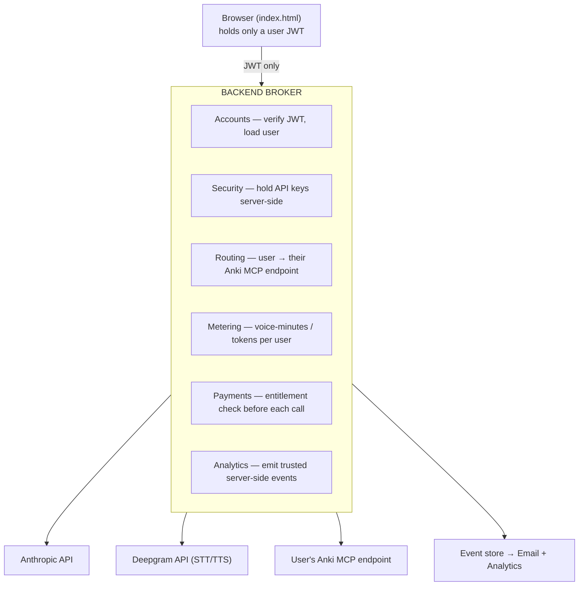

# Anki Voice — Demo → Product Architecture

**Status:** Draft for team review · **Date:** 2026-06-14
**Purpose:** Single source of truth for turning the hackathon demo into a real SaaS. Covers the six application-layer concerns — **Accounts, Security, Payments, Email, Analytics, Marketing** — and the one backend component that ties them together.

> This doc assumes the demo described in [`VOICE_AGENT_HANDOVER.md`](VOICE_AGENT_HANDOVER.md) and the cloud architecture in the README diagram. Read those first for client/infra detail.

---

## 1. Where we are today (the demo)

```
Browser (index.html)                 AWS EC2 (Docker)
─────────────────────                ─────────────────
• ANTHROPIC_API_KEY  ─┐              headless-anki  ──┐ sync
• DEEPGRAM_API_KEY    ├─ hardcoded   AnkiConnect :8765 │
• MCP_SERVER_URL     ─┘              ankimcp server ───┘ → AnkiWeb
• conversationHistory in memory      EBS volume (prefs.db)
• Calls Claude + Deepgram directly   AnkiMCP Tunnel (WebSocket + OAuth)
```

Three properties make this a **demo, not a product**:

1. **All secrets are in the browser.** Anyone who opens the page can extract the Anthropic/Deepgram keys and spend our money without limit.
2. **One shared Anki collection.** A single `headless-anki` instance = one AnkiWeb account for everyone. No notion of "my cards."
3. **No persistence or identity.** Conversation lives in a JS array; there are no users, sessions, or events stored anywhere.

Everything below exists to fix exactly those three things — nothing more elaborate than necessary.

---

## 2. The core idea: one backend broker

Five of the six layers collapse into a single new component: a **backend broker** that sits between the browser and every paid/sensitive API. The browser stops holding secrets and holds only a short-lived user token.



**Why a broker and not "just add auth to the HTML":** the keys *must* leave the client, and per-user Anki routing *must* happen somewhere trusted. Once you have that trusted server, payments-entitlement, metering, and event capture are nearly free to add there too. It is the natural home for all of it.

### Broker responsibilities, request by request
On every voice turn the broker:
1. Validates the user's JWT (**Accounts**).
2. Checks the user is entitled / under quota (**Payments + Metering**).
3. Injects the real Anthropic key and the user's `MCP_SERVER_URL` (**Security + Routing**).
4. Proxies the call to Claude (and the Deepgram stream — see §5).
5. Records token/minute usage and emits events (**Metering + Analytics**).

---

## 3. Two gating decisions

These two choices determine the shape of everything else. Recommendations below are **proposed defaults — please confirm or override.**

### Decision A — Per-user Anki topology *(proposed: link user's own AnkiWeb, lazily synced)*
How does each user get "their" cards?

| Option | How | Pros | Cons |
|---|---|---|---|
| **A1. One container per user** | A `headless-anki` container per user (ECS/Fargate or Fly Machines) | Clean isolation; mirrors current demo | Expensive; idle cost per user destroys margin; slow cold starts |
| **A2. ✅ Link user's own AnkiWeb, lazily synced** | User provides AnkiWeb login (or we sync on demand); we spin a synced collection only during an active session, then tear down | Cheap (pay only during sessions); matches "syncs to *your* Anki" promise | We must hold AnkiWeb credentials → see Security §4; cold-sync latency at session start |
| **A3. Stop using AnkiWeb sync; store cards ourselves** | Import decks into our own DB; write our own SRS scheduler | Full control; no AnkiWeb dependency | Huge scope; breaks the "syncs back to your Anki app" value prop |

**Recommendation: A2.** It's the only option that keeps unit economics sane *and* honors the core promise ("your progress syncs to your Anki on all devices"). The cost is holding AnkiWeb credentials, which §4 addresses. Revisit A1 only if cold-sync latency proves unacceptable.

### Decision B — Identity / auth provider *(proposed: Supabase)*
Where do user accounts live, and how does it relate to the existing tunnel OAuth?

| Option | Pros | Cons |
|---|---|---|
| **B1. ✅ Supabase (Auth + Postgres)** | Identity *and* the DB we need anyway, one vendor; RLS for data isolation; cheap early | Slightly less polished auth UI than Clerk |
| **B2. Clerk + separate DB** | Best-in-class auth UX, fastest drop-in | Two vendors; still need a DB elsewhere |
| **B3. Reuse AnkiMCP tunnel OAuth as our IdP** | No new auth system | Couples our identity to a third party's OAuth; unclear if it's *our* IdP to control |

**Recommendation: B1 (Supabase).** We need a database for the user→Anki-endpoint table, sessions, usage, and events regardless. Supabase gives auth + Postgres + row-level security in one place. The tunnel's OAuth stays as the *transport* auth between broker and Anki, not our user identity. (If auth UX speed matters more than vendor consolidation, swap to Clerk — B2.)

---

## 4. Layer-by-layer design

### Security (do this first — it's the reason for the broker)
- **Get keys off the client.** Anthropic + Deepgram keys live only in the broker's environment. The browser receives a short-lived user JWT.
- **AnkiWeb credentials (from Decision A2).** This is our biggest liability. Mitigations, in priority order:
  1. **Avoid storing the password if possible** — prefer a session-scoped token, or have the user re-enter on link and store only a sync session.
  2. If we must store it: **envelope encryption** (per-user data key wrapped by a KMS master key), encrypted at rest, **never logged**, access scoped to the sync worker only.
- **Cost-abuse is a security problem here.** An unauthenticated or leaked broker endpoint = direct, unbounded spend. Enforce per-user **quotas** and global **rate limits** on every metered route.
- Table stakes: HTTPS everywhere, strict CORS (only our origin), input validation, dependency scanning, no secrets in git (`.gitignore` already exists — verify keys are excluded).

### Accounts
- Supabase Auth: email magic-link + Google sign-in (Anki's audience skews student → Google is common).
- Core data the broker needs (see §6): `users`, `anki_links` (user → their Anki endpoint / sync state), `subscriptions`, `usage`.
- **Linking flow:** after signup, user connects their AnkiWeb (Decision A2). This is the critical onboarding step — instrument it heavily (§ Analytics).

### Payments
- **Stripe** for subscriptions; consider **Paddle/Lemon Squeezy** (Merchant of Record) if we sell internationally and want them to handle VAT/sales tax.
- **Pricing model:** voice + LLM has real per-minute COGS, so avoid unlimited flat-rate. Proposed: **free trial (N minutes)** → **paid tier with a generous monthly minutes cap** → optional metered overage. Final numbers TBD once we measure cost-per-session.
- **Entitlement, not just checkout:** the broker checks `subscription.active && usage < cap` before each metered call. Stripe webhooks update entitlement; the broker reads it.

### Email
Three distinct jobs — don't conflate:
- **Transactional** (receipts, magic links, "session summary"): **Resend** or **Postmark**.
- **Lifecycle** ("you haven't reviewed in 3 days", streak nudges, trial-ending): **Loops** or **Customer.io**, triggered off the event store.
- **Deliverability is non-negotiable and slow:** set up SPF, DKIM, DMARC on the sending domain early — domain warming takes days.
- The waitlist (currently Typeform/Form per README) should feed directly into the lifecycle list.

### Analytics
- **PostHog** — events, funnels, session replay, and feature flags in one tool. Replay is especially valuable for a novel *voice* UX (see where people get stuck).
- **Emit events server-side from the broker** (client events are spoofable and unreliable mid-voice-session).
- **The activation funnel to instrument:**
  `landing → signup → AnkiWeb linked → first session started → 5+ cards reviewed → day-2 return → paid`
  (Note: "5 cards reviewed" is literally the README's Definition of Done — that's our activation metric.)
- **Voice-specific events:** `mic_permission_granted`, `first_utterance`, `card_presented`, `card_rated`, `stt_error`, `tts_error`, `session_completed`. STT/TTS errors are the most likely silent churn driver.

### Marketing
- **Channel:** Anki has a concentrated, high-intent community — r/Anki, r/medicalschool, r/lawschool, Anki Discords, med/law student forums. Cheapest, highest-converting acquisition. Start there.
- **Asset that matters most:** the demo video. Voice UX does not sell in screenshots.
- **Attribution:** UTM tags on every link → captured by the broker → PostHog, so we know which channel converts to *paid*, not just signups.
- **Site:** landing page (spec in README) + waitlist → Loops. SEO play later ("review Anki by voice", "hands-free Anki", "Anki voice mode").

---

## 5. One technical wrinkle: Deepgram STT is a browser WebSocket

Per the handover, STT is a streaming WebSocket opened *from the browser* with the Deepgram key in the connect header. You can't hide that behind a simple HTTP proxy. Two options:

- **A. Proxy the WebSocket through the broker** — browser ↔ broker ↔ Deepgram. Full control, more broker complexity.
- **B. Mint short-lived scoped Deepgram tokens server-side** — broker issues a temporary, restricted token the browser uses directly. Simpler, smaller blast radius if leaked.

**Lean toward B** unless we need to inspect/meter the audio stream itself. TTS and Claude are plain HTTP and proxy cleanly through the broker.

---

## 6. Minimal data model (Supabase / Postgres)

```
users           (id, email, created_at, ...)              ← Supabase Auth
anki_links      (user_id, endpoint_url, sync_state,
                 encrypted_credentials, last_synced_at)   ← Decision A2 + Security
subscriptions   (user_id, stripe_customer_id, plan,
                 status, current_period_end)              ← Payments
usage           (user_id, period, voice_minutes,
                 input_tokens, output_tokens)             ← Metering / entitlement
sessions        (id, user_id, started_at, ended_at,
                 cards_reviewed)                          ← Analytics / summaries
events          (id, user_id, type, payload, ts)          ← Analytics + Email triggers
```

Row-level security keyed on `user_id` gives us per-user isolation for free.

---

## 7. Suggested sequencing (demo → first paying user)

| Phase | Goal | Build |
|---|---|---|
| **0. Now** | Demo works | (done — current `index.html`) |
| **1. Broker + Security** | Keys off the client | Stand up broker; proxy Claude + Deepgram; browser holds JWT |
| **2. Accounts + Anki linking** | "My cards" | Supabase auth; AnkiWeb link flow (Decision A2); user→endpoint routing |
| **3. Analytics** | See the funnel | PostHog events from broker; activation funnel dashboard |
| **4. Payments** | Take money | Stripe trial + paid tier; entitlement check in broker |
| **5. Email + Marketing** | Retain + acquire | Transactional + lifecycle email; community launch + demo video |

Each phase is shippable on its own; 1 → 2 are the hard, gating ones.

---

## 8. Open questions for the team
- [ ] **Decision A** — confirm per-user Anki topology (proposed: A2, link own AnkiWeb).
- [ ] **Decision B** — confirm identity provider (proposed: Supabase).
- [ ] Is the AnkiMCP tunnel OAuth *ours* to control, or AnkiMCP's? (Affects whether B3 is even viable.)
- [ ] Can we get a Deepgram **scoped/temporary token** API? (Determines §5 choice.)
- [ ] Cost-per-session measurement — needed before final pricing.
- [ ] Product name still undecided (Anki Convo / Recall / CardIO) — blocks domain, email sending domain, and social.
